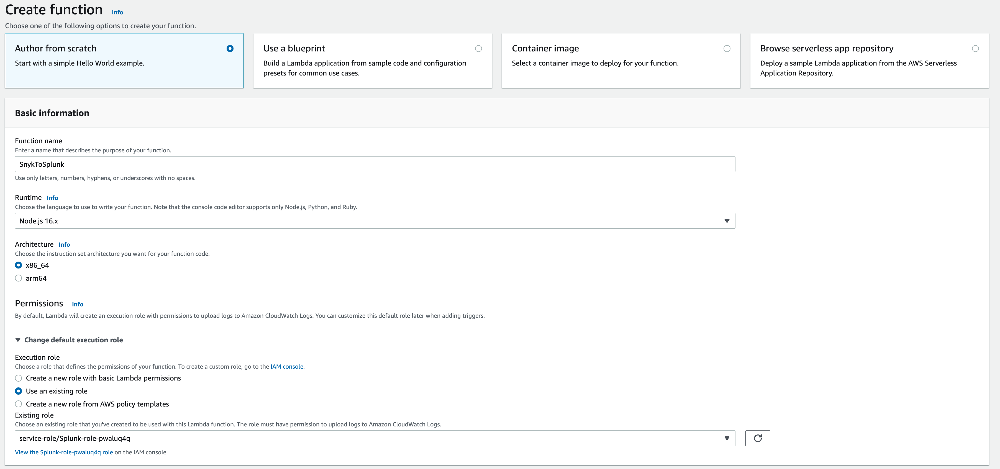
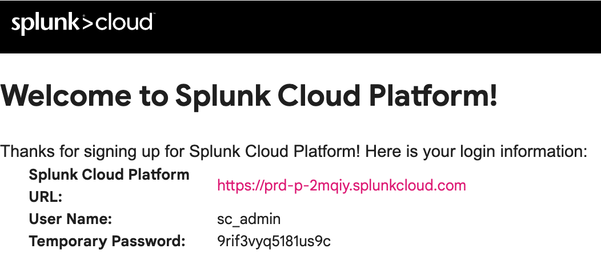
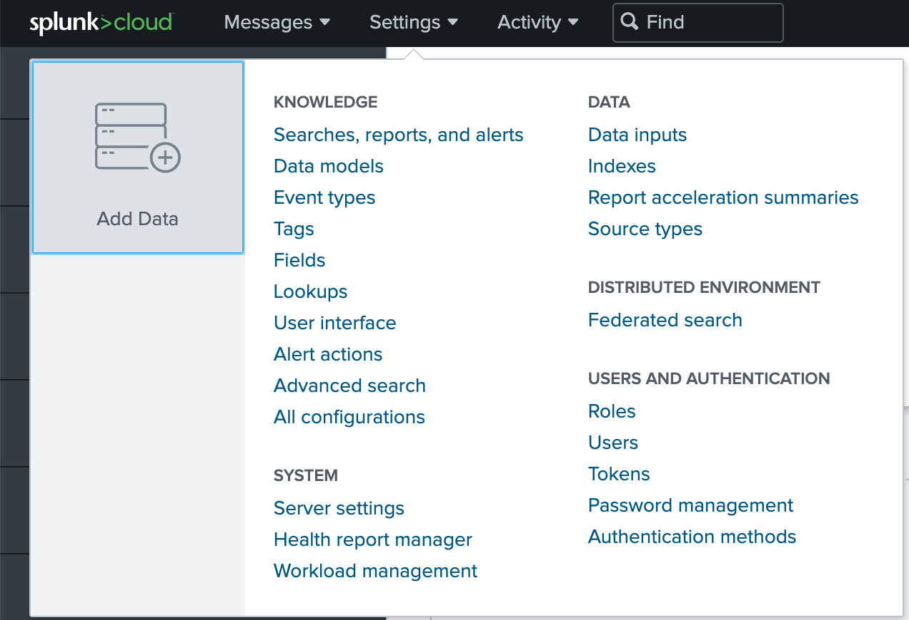
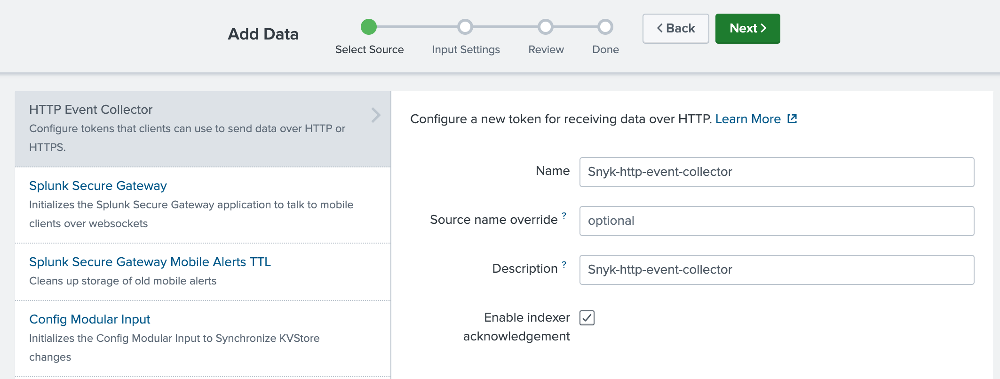
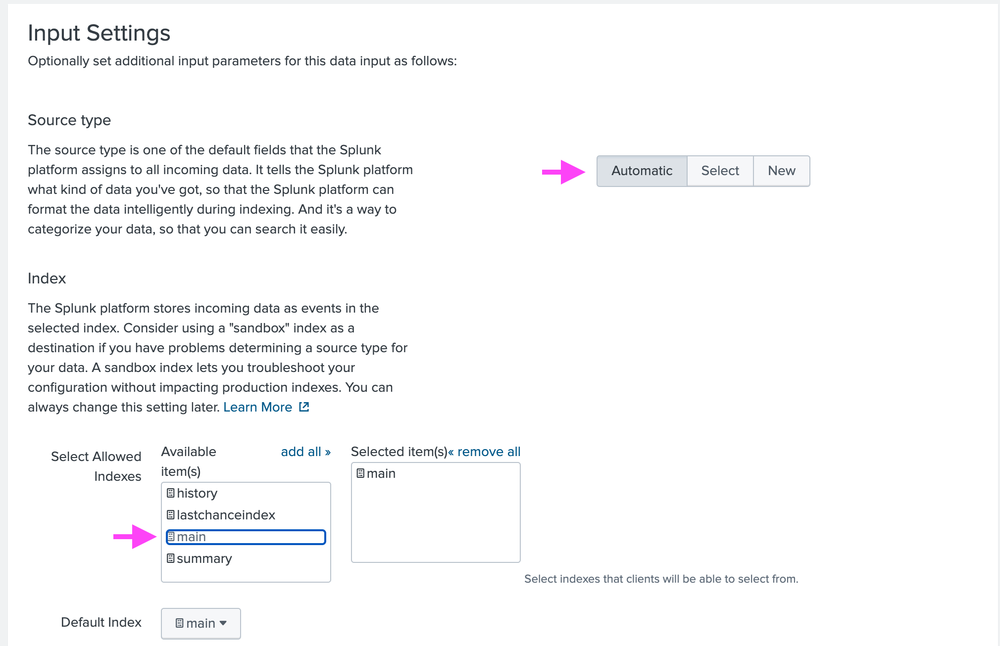

# Snyk-to-Splunk using the Splunk HTTP-Event-Collector
Connect Snyk to Splunk by leveraging the Splunk HTTP Event Collector and visualise your vulns to Splunk.   

## Useful resources   
I recommend the following resources:
- Forward Snyk Vulnerability data [to Splunk Observability Cloud](https://www.kimpel.com/post/forward-snyk-vuln-data-to-splunk/), *(Harry Kimpel)* 
- Snyk [webhook subscription](https://github.com/harrykimpel/snyk-webhook-subscription/), *(Harry Kimpel)*

## Prerequisites
- An AWS account with access to:<br/>
	- Create new roles (or use an existing one)<br/>
	- Modify Lambda functions<br/>
	- Modify API Gateway<br/>
- Snyk account with Organization Admin access<br/>
- Splunk Clound account - note: **not the same** as Splunk Observability Cloud!<br/>

## List of content
- [1. AWS Setup](#1-aws-setup)<br/>
	- [1.1 Create a new IAM role (upfront) for the AWS Lambda function](#11-create-a-new-iam-role-upfront-for-the-aws-lambda-function)<br/>
	- [1.2 Create a Lambda function](#12-create-a-lambda-function)<br/>
	- [1.3 Setting up the HTTP Event Collector in Splunk Cloud](#13-setting-up-the-http-event-collector-in-splunk-cloud)<br/>
	- [1.4 Setting the necessary environment variables](#14-setting-the-necessary-environment-variables)<br/>
- 
## 1. AWS Setup
In this section, I'll show you how to configure AWS in order to send data towards Splunk, as well as the background of the 5 implementation steps.

Note: The AWS Lambda function and the API Gateway have to be configured in the same region.   
We are going to use AWS Lambda, because it's a relatively cost-effective and efficient way to run code on events, for example when there is a new Snyk vulnerability.

### 1.1 Create a new IAM role (upfront) for the AWS Lambda function
To start with, we need to create an IAM role that we can assign to the AWS Lambda function. We need to provide basic execution roles and permissions to invoke an API Gateway which we'll be interacting with. If you're interested in the implementation, click below.  
<details>
<summary><b>:hammer_and_wrench: Implementation steps</b></summary>
<br/>
	<table border="0">
		<tbody>
			<tr>
				<td> </td>
				<td>
1. Go to the AWS Console<br/><br/>
2. Navigate to <b>IAM</b><br/><br/>
3. Click on <b>Roles/Create role</b><br/><br/>
4. Select for Trusted entity type: <b>AWS Service</b>, for Use case: <b>Lambda</b>, then click on Next<br/><br/>
5. Search for <b>AmazonAPIGatewayInvokeFullAccess</b> (we'll be interacting with the API Gateway) and <b>AWSLambdaBasicExecutionRole</b> among the Permissions policies, then click on Next.<br/><br/>
6. Add a (custom) name for the role, then click on <b>Create role</b><br/>
				</td>
			</tr>
		</tbody>
	</table>
<b>Note:</b> automatically created roles in AWS Lambda will restrict the "Resources", instead of  

```
"Resource": "*"
```
You will see something like:
```json
{
    "Version": "2012-10-17",
    "Statement": [
        {
            "Effect": "Allow",
            "Action": "logs:CreateLogGroup",
            "Resource": "arn:aws:logs:us-west-2:880724394176:*"
        },
        {
            "Effect": "Allow",
            "Action": [
                "logs:CreateLogStream",
                "logs:PutLogEvents"
            ],
            "Resource": [
                "arn:aws:logs:us-west-2:880724394176:log-group:/aws/lambda/Splunk:*"
            ]
        }
    ]
}
```
</details>

You can check, your roles should look like these (AWS build-in roles)

```json
//AmazonAPIGatewayInvokeFullAccess
{
    "Version": "2012-10-17",
    "Statement": [
        {
            "Effect": "Allow",
            "Action": [
                "logs:CreateLogGroup",
                "logs:CreateLogStream",
                "logs:PutLogEvents"
            ],
            "Resource": "*"
        }
    ]
}
```


```json
//AWSLambdaBasicExecutionRole
{
    "Version": "2012-10-17",
    "Statement": [
        {
            "Effect": "Allow",
            "Action": [
                "execute-api:Invoke",
                "execute-api:ManageConnections"
            ],
            "Resource": "arn:aws:execute-api:*:*:*"
        }
    ]
}
```

### 1.2 Create a Lambda function
---
:genie: **The fastest and most convenient way is to go to [Splunk's development site](https://dev.splunk.com/enterprise/docs/devtools/httpeventcollector/useawshttpcollector/createlambdafunctionnodejs/) and create a Lambda function using a Splunk blueprint:** select the "splunk-logging" blueprint option, or click [here to immediate action within AWS Lambda](https://console.aws.amazon.com/lambda/home?#/create/configure-triggers?bp=splunk-logging)

---

Alternatively, of course we can create own our JavaScript code as described below.
<details>
<summary><b>:hammer_and_wrench: Implementation steps</b></summary>
<br/>
	<table border="0">
	<tbody>
		<tr>
			<td> </td>
			<td>
1. Go to the AWS Console<br/><br/>
2. Navigate to <b>Lambda</b><br/><br/>
3. Click on <b>Create function</b><br/><br/>
4. Choose <b>Node.js 16.x</b> for the Runtime<br/><br/>
5. <b>x86_64</b> for the architecture<br/><br/>
6. Attach the previously created <b>role</b> ("Use an existing role") to the Lambda function<br/>
(you can also create a new role, but make sure that you attach the <b>AmazonAPIGatewayInvokeFullAccess policy</b> in IAM to it afterwards)<br/><br/>
8. Click on <b>"Create function"</b><br/><br/>
9. In the code section paste the function "[splunk-logging.js](https://github.com/mcsnyk/Snyk-to-Splunk-HTTP-Event-Collector/blob/main/scripts/splunk-logging.js)" file!<br/>  
			</td>
		</tr>
	</tbody>
</table>

The configuration should look like this:

</details>

### 1.3 Setting up the HTTP Event Collector in Splunk Cloud
Our intention is to get data in Splunk Cloud via monitoring. We'll leverage the Splunk HTTP Event Collector, which is an endpoint that lets developers send application events directly to the Splunk platform via HTTP or HTTPS using a token-based authentication model.<br/>  
It's a handy solution, because we can use the Splunk .NET and Java logging libraries or any standard HTTP Client that lets us send data in JavaScript Object Notation (JSON) format.<br/>       
The HTTP Event Collector receives data over HTTPS on TCP port 8088 by default. We can change this port, as well as disable HTTPS.<br/>  

<details>
<summary><b>:hammer_and_wrench: Implementation steps</b></summary>
<br/>
1. Log in to your <b>Splunk Cloud account</b> (you receive the login information via email, like the Splunk Cloud Platform URL, the Username and a Temporary Password)<br/>
<br/><br/>
2. After a succesful log in, navigate to <b>Settings</b> in the top menu bar and select the Add Data icon!<br/>
<br/><br/>
3. In the <b>Or get data in with the following methods </b> section choose Monitor<br/><br/>
4. Among the many options choose <b>HTTP Event Collector</b><br/><br/>
5. Give a name for your Token and make sure that the option <b>Enable indexer acknowledgement</b> is selected!<br/>
<br/><br/>
6. On the Input Settings site the source type should be <b>automatic</b>, and we can allow the <b>main </b>index (The Splunk platform stores incoming data as events in the selected index):<br/>
<br/><br/>
7. After reviewing all the information, we're done, you should see the generated Token Value:<br/>
<br/><br/>
</details>

### 1.4 Setting the necessary environment variables
In order to interact with Splunk and the Splunk HTTP event collector, we need to set two environment variables:

**SPLUNK_HEC_URL**: URL address for your Splunk HTTP event collector endpoint.
Default port for event collector is 8088. Example: https://host.com:8088/services/collector

**SPLUNK_HEC_TOKEN**: Token for your Splunk HTTP event collector.
To create a new token for this Lambda function, refer to Splunk Docs:
http://docs.splunk.com/Documentation/Splunk/latest/Data/UsetheHTTPEventCollector#Create_an_Event_Collector_token   

<details>
<summary><b>:hammer_and_wrench: Implementation steps</b></summary>
<br/>
1. Go to <b>Configuration</b> in your AWS Lambda<br/><br/> 
2. Click on <b>Environment</b> variables<br/><br/>
3. Add new environment variables (if you created the Lambda function on your own and didn't use the Splunk blueprint): <br/>
**SPLUNK_HEC_TOKEN** and **SPLUNK_HEC_URL**. Don't worry, we'll give them values in a minute.<br/>
</details>

